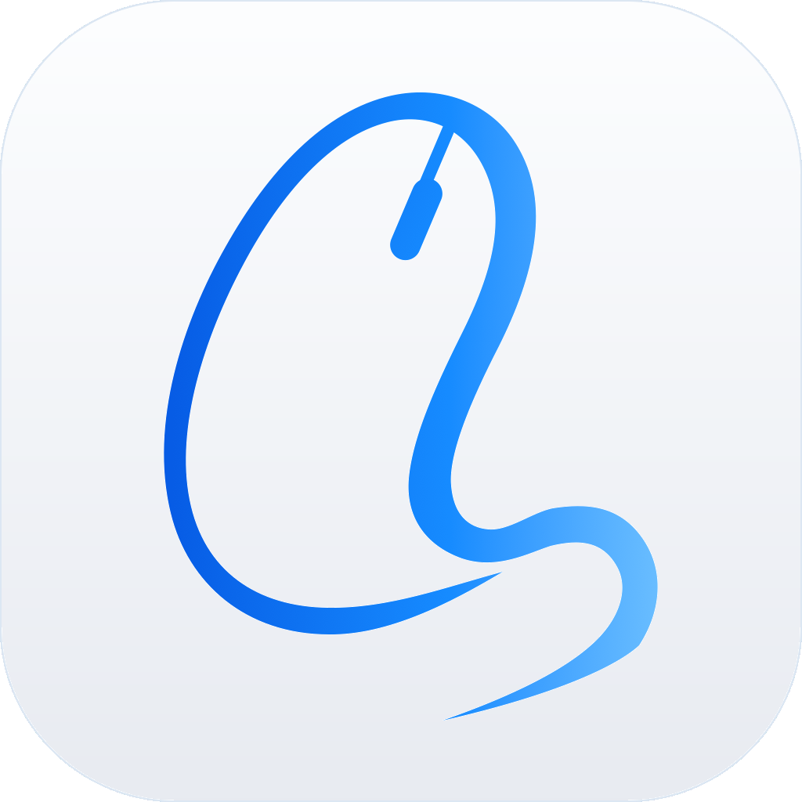
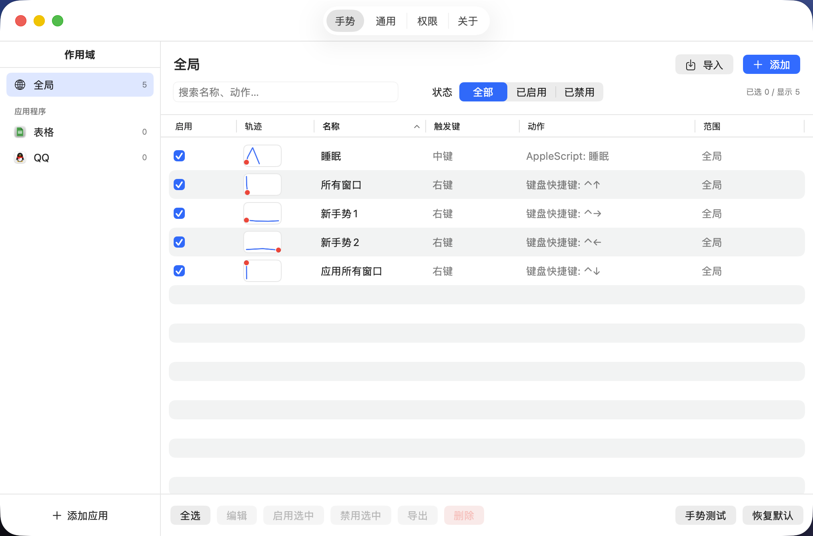
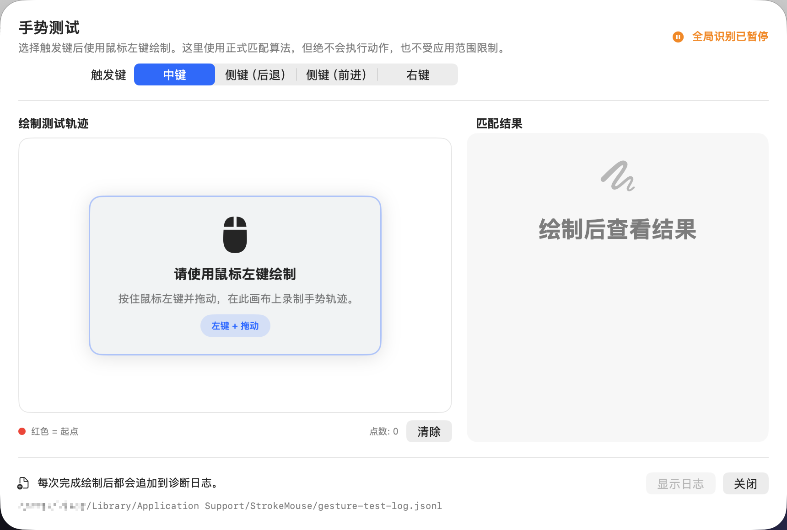
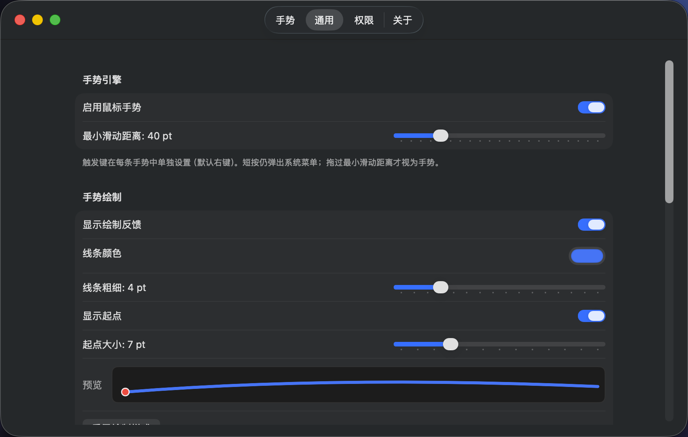
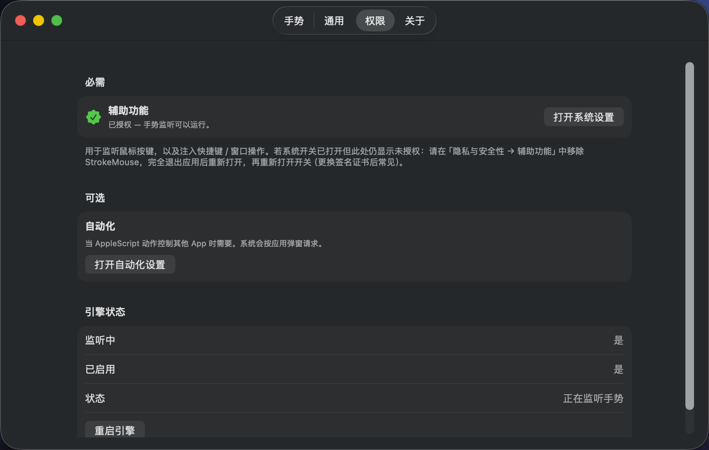
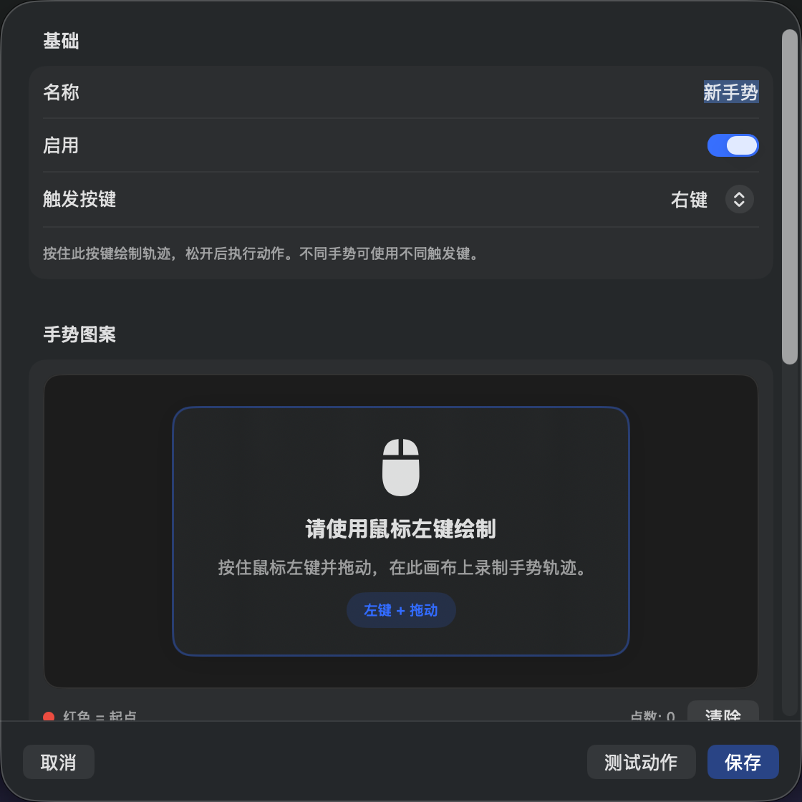
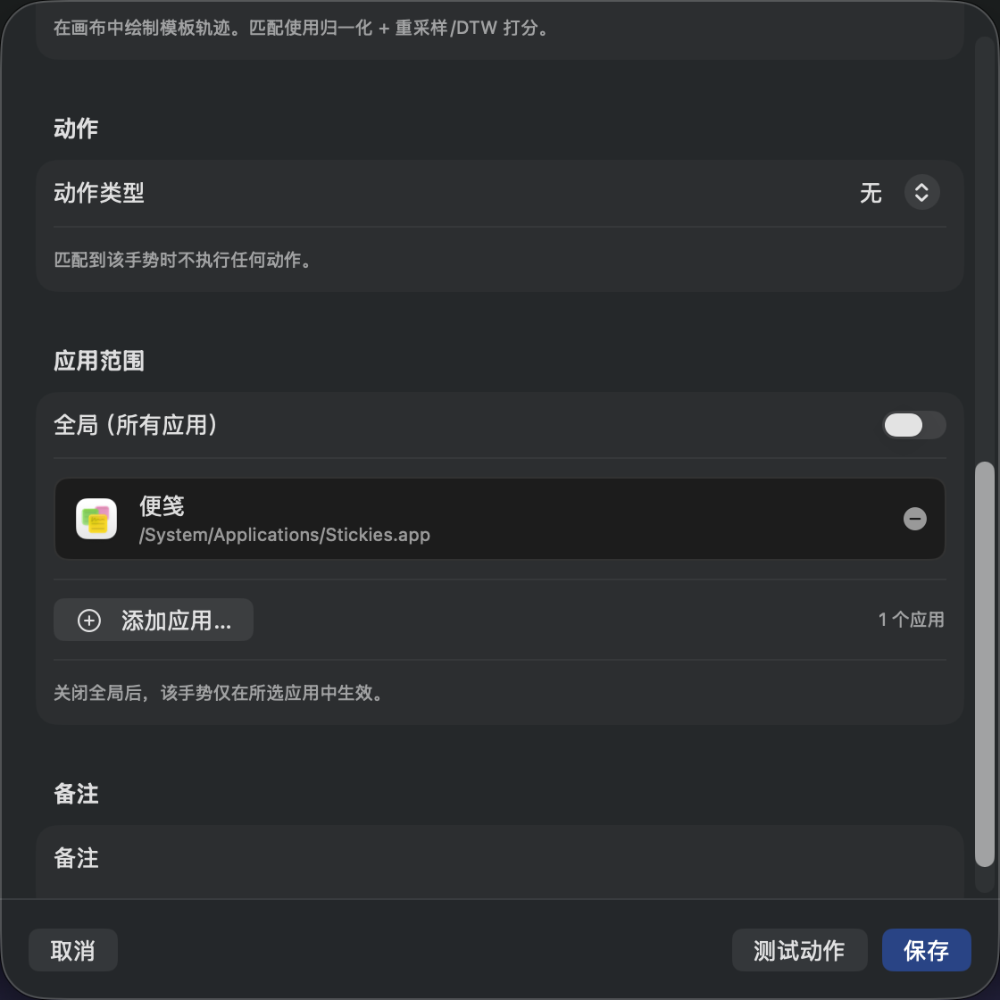

<div align="center">
  
  <h1>StrokeMouse</h1>
  <p>
    <a href="./README.md">中文</a> · <b>English</b>
  </p>
  <p>
    <a href="./LICENSE"></a>
  </p>
</div>

Custom mouse gestures for macOS. Hold a **per-gesture trigger** (right button by default; middle or side buttons also work), draw a stroke, and run shortcuts, open apps, window commands, media keys, Shell / AppleScript, and more. Gestures can be **global or app-scoped**, configs are **importable/exportable**, and everything runs locally from the menu bar.

## Screenshots

| Gesture list | Gesture test |
|:---:|:---:|
|  |  |

| General settings | Permissions |
|:---:|:---:|
|  |  |

| Record stroke | App scope |
|:---:|:---:|
|  |  |

## Features

- **Menu bar app**: enable/disable gestures, open settings, quit; icon tints by status (normal / paused / needs permission); optional **hide menu bar icon** (confirm if Dock is also hidden; reopen via Dock or relaunch to open settings)
- **Gesture library**: sidebar by **Global / per-app** (new gestures inherit the selected scope); search / filter / sort; multi-select batch enable, disable, delete; **JSON import/export** (skip or force-import duplicates)
- **Per-gesture triggers**: right button by default; middle / side buttons optional; only enabled triggers are monitored
- **Per-gesture target**: choose the frontmost app or the app under the pointer at trigger-down; when a regular window exists, its exact window is frozen too, and app-scope checks and target-aware actions always reuse that target
- **Free-path recognition**: arc-length resampling + 1D/2D normalization + limited rotation; significant-turn structure gates; live stroke HUD while holding the trigger
- **App scope**: global, or pick apps by icon from installed applications (search / browse `.app`)
- **Actions**: shortcuts, open app (icon picker), URL, media keys, window actions, Shell / AppleScript (syntax-highlighted editor; AppleScript presets such as sleep, lock screen, empty trash, plus custom)
- **Polish**: EN / 中文 UI, light/dark appearance (system or forced), launch at login, hide Dock / menu bar icon, Sparkle in-app updates (falls back to GitHub Releases on failure)

## Requirements

- macOS 14 Sonoma or later
- Xcode 16+ (for development builds)
- Any mouse works (default gestures use the right button; change per gesture in the editor)

## Permissions

| Permission | Purpose |
|------------|---------|
| **Accessibility** | Global mouse listening (`CGEventTap`), shortcut injection, window AX actions |
| **Automation** | Optional; required when AppleScript controls other apps |

On first launch or **Settings → Permissions**, use in-app **Guide Me**: open System Settings and drag StrokeMouse into the list. Without trust the engine will not pretend to listen.

## Build & run

### Dependencies

```bash
brew install xcodegen
```

### Generate the project and open

```bash
./scripts/generate_project.sh
open StrokeMouse.xcodeproj
```

Or **Run** directly in Xcode (Scheme: `StrokeMouse`).

### CLI build (recommended)

Produces a stable path at `output/StrokeMouse.app`, which reduces repeated Accessibility prompts.  
Debug shows as **StrokeMouse Dev** (Bundle ID `com.strokemouse.app.dev`) so it can be authorized separately from the release **StrokeMouse** app:

```bash
./scripts/build.sh           # Debug → output/StrokeMouse.app (Accessibility: StrokeMouse Dev)
./scripts/build.sh --open    # open after build
./scripts/build.sh --release # Release (same display name / Bundle ID as shipping builds)
```

### Release packaging

Build ZIP, TAR.GZ, and DMG per architecture, and verify signature, entitlements, and artifact integrity:

```bash
# First time locally: ./scripts/generate-codesign-cert.sh --import
SPARKLE_PUBLIC_KEY="..." ARCH=arm64 ./scripts/package-app.sh
SPARKLE_PUBLIC_KEY="..." ARCH=x86_64 ./scripts/package-app.sh
```

Release packaging uses the stable self-signed identity **`StrokeMouse Release`** so Accessibility grants survive Sparkle updates. See `RELEASING.md` / `certs/README.md`.


Bump versions with `./bump.sh -v x.y.z [-p]`. Re-tag the same version and push with `./bump.sh -v x.y.z --force`.

### Tests

```bash
xcodebuild -scheme StrokeMouse -configuration Debug test
```

## Usage

1. Launch the app; a mouse icon appears in the menu bar  
2. Grant **Accessibility**, then enable gestures from the menu bar  
3. Open **Settings → Gestures** to review defaults or create new ones  
4. Hold the gesture’s **trigger** (right button by default; change in the editor), draw a path, release  
5. On a successful match, the bound action runs  

> **Short click vs gesture**: trigger down/up is temporarily captured by the engine. If you release before the minimum stroke distance, a normal click is replayed so the context menu still works. Once drawing starts, drag still moves the system cursor and stroke HUD, but the frontmost app does not receive a paired down/up—so no context menu appears or is selected. Left click and buttons not configured as triggers are always passed through.

> Shortcuts activate the frozen app first and also bring its exact window forward when one was captured, which may switch focus or Spaces. Locations without a regular window, such as the Finder desktop, can still run shortcuts and **Hide App**; Close, Minimize, Zoom, Full Screen, and Center still require an exact window. A short click never activates the target.

Default gesture examples (right button by default; each gesture can use a different button):

| Gesture | Action |
|---------|--------|
| ↑ | Mission Control (⌃↑) |
| ↓ | Application windows (⌃↓) |
| ↓← | Minimize window |
| ↓→ | Close window |
| ↑→ | Open Safari |
| →← | Play / pause |
| ↑← | Open GitHub |

## Config file

Path:

```text
~/Library/Application Support/StrokeMouse/gestures.json
```

Day to day, multi-select under **Settings → Gestures** to export / import JSON packages. For a full-library backup, copy the file above or edit by hand (keep the structure valid). Settings can **Reveal in Finder**.

## Tech stack

- Swift / SwiftUI (macOS 14+)
- Lightweight MVVM + Service
- `CGEventTap` for global mouse events
- JSON config persistence
- [LaunchAtLogin-Modern](https://github.com/sindresorhus/LaunchAtLogin-Modern) for login launch
- [Sparkle](https://github.com/sparkle-project/Sparkle) for signed in-app updates
- XcodeGen for the Xcode project

## License & disclaimer

This project is licensed under the [GNU Affero General Public License v3.0 (AGPL-3.0)](./LICENSE).

This is a local utility. Global event monitoring and script actions are powerful. Only add Shell / AppleScript you trust. The author is not responsible for misuse or accidental damage.
